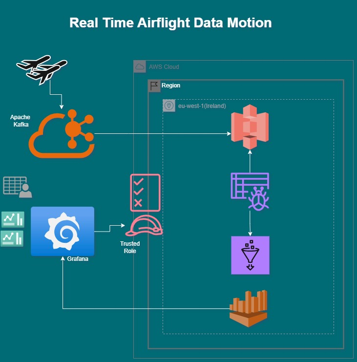

# ✈️ Real-Time Airflight Data Pipeline with Kafka, AWS, and Grafana

Welcome to the **Airflight Real-Time Analytics Pipeline** – a robust end-to-end data engineering solution that streams live airflight data, processes it in the cloud, and visualizes business insights through a real-time dashboard. This project demonstrates the seamless integration of **Apache Kafka**, **AWS (S3, Glue, Athena, CloudWatch)**, and **Grafana Cloud**, orchestrated by Python.

---

## 📖 The Story Behind This Project

In today's world of aviation, **timely decisions are everything**. Whether it's optimizing air traffic routes, monitoring delays, or analyzing airline performance — real-time data is the key. This project simulates a production-grade environment where airflight data is ingested live, stored securely, processed intelligently, and visualized meaningfully.

Built with scalability, cost-efficiency, and observability in mind, this project mirrors what modern data-driven companies demand today.

---

## 🧰 Tools and Technologies Used

| Category            | Tools/Services                          |
|---------------------|-----------------------------------------|
| Streaming           | Apache Kafka (1 topic, 1 partition)     |
| Cloud Storage       | AWS S3                                  |
| Data Processing     | AWS Glue, Athena                        |
| Dashboard & BI      | Grafana Cloud                           |
| Monitoring          | AWS CloudWatch                          |
| Security & IAM      | AWS IAM (Roles, Policies)               |
| Language            | Python 3.8+                             |
| Version Control     | Git & GitHub                            |

---

## 🌍 Project Workflow: From Data to Dashboard


---
[]
---
## ✅ Key Features & Benefits

✨ **Real-Time Insights**: Visualize airflight data as it arrives.

🔁 **Event-Driven Design**: Kafka ensures resilient, scalable ingestion.

☁️ **Cloud-Native**: Entirely serverless and AWS-integrated.

🔍 **Schema Discovery**: Glue crawler dynamically builds schemas.

🧠 **SQL-Based Analytics**: Athena provides powerful SQL over S3.

📊 **BI Integration**: Grafana Cloud displays live dashboards securely.

🔐 **Enterprise Security**: IAM roles, policies, and trusted entities in place.

---

## 🔥 Challenges Faced & Solution

- **Challenge:** Kafka message batching and fault tolerance
  **Solution:** Work in progress

- **Challenge:** Grafana Cloud connection with AWS  
  **Solution:** Created IAM Trusted Role for secure cross-account access.


---

## 🛠️ Setup Instructions


---

## 📂 Step 1: Ingest CSV Data to Kafka


```python
from kafka import KafkaProducer
from kafka.errors import KafkaError
import os
import time
import pandas as pd
import json


def read_csv_file(file_path,size):
    try:
        df = pd.read_csv(file_path, chunksize=size)
        return df
    except FileNotFoundError:
        print(f"File not found: {file_path}")
        return None
    except pd.errors.EmptyDataError:
        print(f"Empty data in file: {file_path}")
        return None
    except Exception as e:
        print(f"Error reading file: {e}")
        return None 
    

def produce_messages(topic_name, airplane_chuk):
            try:
                producer = KafkaProducer(bootstrap_servers='127.0.0.1:9092' , value_serializer=lambda v: json.dumps(v).encode('utf-8'))
            except KafkaError as e:
                print(f"Error connecting to Kafka broker: {e}")
                producer = KafkaProducer()  
                return
            try:
                producer.bootstrap_connected()
                print("Kafka broker is connected")
            except KafkaError as e:
                print(f"Error connecting to Kafka broker: {e}")
                return
            
            ack = producer.send(topic_name, value=airplane_chuk)
            metadata = ack.get()
            #Get the message delivered report
            print(f"Message produced successfully to topic {metadata.topic} partition {metadata.partition} offset {metadata.offset}")
            producer.flush()
            producer.close()
            return metadata.offset 
            
#Main function to run the script
def main():
    topic_name = os.getenv('KAFKA_TOPIC')
    file_path = os.getenv('CSV_FILE_PATH')
    file_name = os.path.basename(file_path)
    print(f"File name: {file_name} starting prcessing and producing messages to topic: {topic_name}")
    chunksize=10
    airplane_chunk_text = read_csv_file(file_path,chunksize)
    
    if airplane_chunk_text is not None:
       
       for airplane_chunk in airplane_chunk_text:
            print("#############Starting to produce messages#############")
            airplnae_dict = airplane_chunk.to_dict(orient='records')[0]
            offestcount =produce_messages(topic_name, airplnae_dict)
            time.sleep(2)
           
    
    else:
        print("Failed to read CSV file.")


if __name__ == "__main__":
    main()
    

```

---

## 📤 Step 2: Consume from Kafka and Push to S3 (JSON)

```python
from kafka import KafkaConsumer, TopicPartition
from kafka.errors import KafkaError
import time
import os
import boto3
import json
import sys
import pandas as pd
from dotenv import load_dotenv


load_dotenv()
TOPIC_NAME = os.getenv('KAFKA_TOPIC')
KAFKA_BOOTSTRAP_SERVERS = os.getenv('KAFKA_BOOTSTRAP_SERVERS')
AWS_ACCESS_KEY_ID = os.getenv('AWS_ACCESS_KEY_ID')
AWS_SECRET_ACCESS_KEY = os.getenv('AWS_SECRET_ACCESS_KEY')
BUCKET_NAME = os.getenv('S3_BUCKET_NAME')
FILE_NAME = os.getenv('S3_FILE_NAME')  
                              

def load_data_into_S3(data,filesuffix):
    s3 = boto3.client('s3')
    file_name = FILE_NAME
    file_name = file_name + "_"+ str(filesuffix) + ".json"
    print(f"File name: {file_name} starting prcessing and producing messages to topic: {TOPIC_NAME}")
    try:        
        if type(data) == str:
            try:    
                data = json.loads(data)
            except json.JSONDecodeError:
                print(f"Error decoding JSON: {data}")
                data = str(data)
            s3.put_object(Bucket=BUCKET_NAME, Key=file_name, Body=json.dumps(data).encode('utf-8'))
        if type(data) == dict:
            s3.put_object(Bucket=BUCKET_NAME, Key=file_name, Body=json.dumps(data).encode('utf-8'))
        if type(data) == list:
            s3.put_object(Bucket=BUCKET_NAME, Key=file_name, Body=json.dumps(data).encode('utf-8'))
        if type(data) == bytes:
            s3.put_object(Bucket=BUCKET_NAME, Key=file_name, Body=data.decode('utf-8').encode('utf-8'))
        print(f"Data loaded into S3 bucket {BUCKET_NAME} with file name {FILE_NAME}")
    except boto3.exceptions.S3UploadFailedError as e:
        print(f"Error uploading data to S3: {e}")
    except boto3.exceptions.S3UploadFailedError as e:
        print(f"Error uploading data to S3: {e}")
        
    except Exception as e:
        print(f"Error loading data into S3: {e}")

#main function to consume messages from kafka topic
def consume_messages(topic_name):
    try:    
        consumer = KafkaConsumer(
            topic_name,
            bootstrap_servers=KAFKA_BOOTSTRAP_SERVERS,
            auto_offset_reset='earliest',
            enable_auto_commit=True,
            value_deserializer=lambda x: x.decode('utf-8')
            
        )
        consumer.subscribe([topic_name])
        
        consumer.poll(timeout_ms=1000)  # Poll for messages
        print("Polling for messages...",consumer)
        for i,count in enumerate(consumer):
            print(f"Consumed: {i} {count.value}")
            load_data_into_S3(count.value,i)
            time.sleep(2)
         
    except KafkaError as e:
        print(f"Error connecting to Kafka broker: {e}")
        return
    
    consumer.close()
    consumer.commit()  # Commit the offsets after consuming messages


#Main method to run the script
def main():
 
    if not TOPIC_NAME:
        print("Topic name is not set. Exiting...")
        return

    consume_messages(TOPIC_NAME)
    print("All messages consumed successfully")


#Call the main function to run the script
if __name__ == "__main__":
    main()
```

---

## 📚 Step 3: Setup AWS Glue Crawler

1. Create a new database in Glue: `airflightdb`
2. Create a crawler:
   - Source: S3 location where data is stored
   - Target: `airflightdb`
   - IAM Role: Allow S3 + Glue access
3. Run the crawler to detect schema and create a table.

---

## 🔐 Step 4: S3 Bucket Policy for Athena Access

```json
{
    "Version": "2012-10-17",
    "Statement": [
        {
            "Effect": "Allow",
            "Action": [
                "s3:GetObject",
                "s3:PutObject"
            ],
            "Resource": [
                "arn:aws:s3:::rajat-first-bucket/*"
            ]
        }
    ]
}
```

---

## 🔎 Step 5: Configure Athena

- Create Athena workgroup and set output location to:
  ```
  arn:aws:s3:::athena-result-bucket-airflight
  ```
- Run queries on the `athena-result-bucket-airflight` table using the Glue Catalog.

---

## 📊 Step 6: Grafana Cloud Setup

### IAM Setup

Create a dedicated IAM user for Grafana:

```json
{
	"Version": "2012-10-17",
	"Statement": [
		{
			"Effect": "Allow",
			"Action": [
				"athena:*",
				"s3:GetObject",
				"s3:PutObject",
				"s3:ListBucket",
				"cloudwatch:*",
				"tag:GetResources",
				"cloudwatch:GetMetricData"				
			],
			"Resource": "*"
		}
	]
}
```


### Grafana Configuration

1. Add Athena as a data source:
   - Access key / secret
   - Region
   - Workgroup
   - Output bucket
2. Create dashboards using SQL queries on `athena-result-bucket-airflight`

---

## 🪵 Step 7: AWS CloudWatch Logging & Monitoring

### IAM Role for Grafana CloudWatch

Create a trusted IAM role with this trust relationship:

```json
{
  "Effect": "Allow",
  "Principal": {
    "Service": "grafana.amazonaws.com"
  },
  "Action": "sts:AssumeRole"
}
```

### Permissions:

```json
{
  "Version": "2012-10-17",
  "Statement": [
    {
      "Effect": "Allow",
      "Action": [
        "cloudwatch:ListMetrics",
        "cloudwatch:GetMetricData",
        "logs:DescribeLogGroups",
        "logs:GetLogEvents"
      ],
      "Resource": "*"
    }
  ]
}
```

Use this IAM Role to connect Grafana Cloud with CloudWatch data source.

---

## ✅ Result

You can now:
- Stream airflight data in real-time.
- Query using Athena.
- Visualize metrics and insights in Grafana.
- Monitor pipeline health using CloudWatch dashboards.

---

## 📦 Requirements

- Python 3.x
- Apache Kafka
- Boto3
- AWS Account with S3, Athena, Glue, IAM, CloudWatch
- Grafana Cloud account
## 📦 Apache kafka Commands

- Kafka Zookeeper Start :bin\windows\zookeeper-server-start.bat config\zookeeper.properties
- Kafka Server Start    :bin\windows\kafka-server-start.bat config\kafka.properties
- Kafka Topic Create : bin\windows\kafka-topics.bat --create --topic quickstart-event --bootstrap-server localhost:9092
- Kafka Topic Describe(checking) : bin\windows\kafka-topics.bat --describe --topic quickstart-event --bootstrap-server localhost:9092
- Kafka Produer to run : bin\windows\kafka-console-producer.bat --topic quickstart-event --bootstrap-server localhost:9092
- Kafka Consumer Check : bin\windows\kafka-console-consumer.bat --topic quickstart-event --from-beginning --bootstrap-server localhost:9092

  
